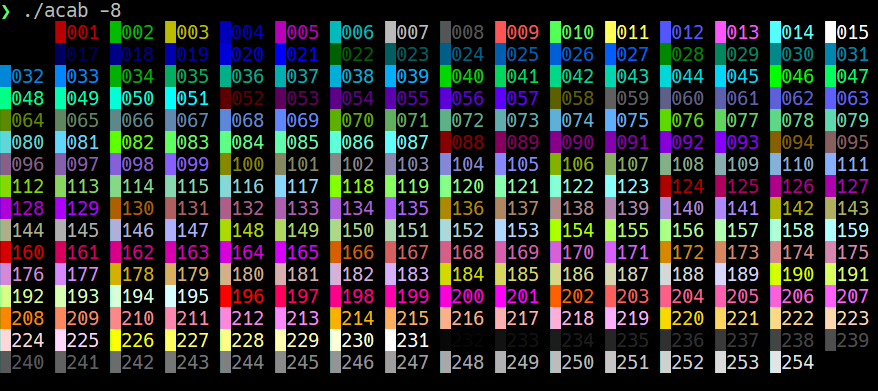

# acab
acab - all colours are beautiful



It really annoyed me that the only way to test ANSI colours in any console was to use an ancient shell script or a few binary files that came with obscene package dependencies.
So why not implement the whole thing in Python?


## Dependencies:
None! More precisely, none outside of those built into Python itself. 


## Usage:
```
acab [options]

Options:
  -h, --help            show this help message and exit
  -3, --8-colours, --8-colors
                        shows a 8 colour ANSI test with escape sequence
                        ^[1;$COLOUR
  -4, --16-colours, --16-colors
                        shows a 16 colour ANSI test with escape sequence
                        ^[2;$COLOUR
  -8, --8-bit-colours, --8-bit-colors
                        shows a 8 bit colour ANSI test with escape sequence
                        ^[38;5;$COLOUR
  -f, --24-bit-colours, --24-bit-colors
                        shows a 24 bit colour ANSI test with escape sequence
                        ^[38;2;$R;$G;$B
```


## Flaws:
A lot! For example, the optparse part was created outside my patience and concentration span and is terribly messed up. I know that myself, and when I have the time and energy, I'll fix that part too.
Similarly, one could certainly build a large, attractive class from all the redundant stuff at some point and equip it with even more functions.
Either way, for a crappy hack in the middle of the night under the influence of questionable substances, I think it's quite okay.


## Tested with:
Alacritty
 - bash
 - zsh 


## How to install:
Simply perform a git clone and copy “acab” to wherever you can access with a Python interpreter. 
As I said, the script really has no significant dependencies except for the standard libraries, which are included with every Python installation anyway.
